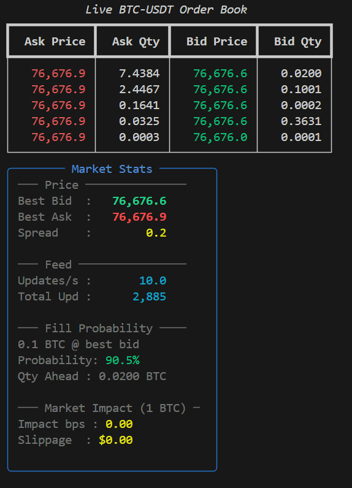

# Live HFT Order Book Simulator

A high-performance, event-driven Limit Order Book (LOB) simulator with live Binance WebSocket feed, built in Python.

## Features

- **Live Data** — Real-time BTC-USDT order book from Binance WebSocket
- **Matching Engine** — Price-time priority matching (FIFO)
- **Fill Probability Model** — Queue position based fill estimation
- **Market Impact Model** — Square-root market impact + slippage estimation
- **Live Terminal Dashboard** — Real-time order book visualization using Rich
- **Benchmarked** — 100K+ events/sec on 1M order simulation

## Demo



*Live BTC-USDT order book with real Binance data — 10 updates/sec*

## Project Structure

```
order_book_simulator/
├── core/
│   ├── order.py              # Order dataclass (Side, OrderType)
│   ├── order_book.py         # LOB engine with SortedDict
│   └── simulator.py          # Event-driven + FastSimulator
├── feed/
│   └── binance_ws.py         # Live Binance WebSocket feed
├── analysis/
│   ├── fill_probability.py   # Queue position fill model
│   └── market_impact.py      # Square-root market impact model
├── dashboard/
│   └── live_dashboard.py     # Rich terminal dashboard
├── benchmark/
│   └── bench.py              # 1M order benchmark
└── main.py                   # Entry point
```

## Installation

```bash
git clone https://github.com/vishalyadav70/order-book-simulator.git
cd order-book-simulator
pip install -r requirements.txt
```

## Usage

### Live Simulator
```bash
python main.py
```
Press `Ctrl+C` to stop.

### Benchmark
```bash
python benchmark/bench.py
```

## Technical Details

### Matching Engine
- Price-time priority (FIFO) matching
- O(log n) insert/delete using `SortedDict`
- Supports Limit, Market, and Cancel orders

### Fill Probability Model
- Exponential decay model based on queue position
- `P(fill) = exp(-λ * qty_ahead / avg_trade_size)`
- Price distance penalty applied

### Market Impact Model
- Square-root model (industry standard)
- `Impact = σ * sqrt(Q / ADV)`
- Real-time slippage estimation via book depth walk

### Performance
- 100K+ events/sec (pure Python)
- P99 latency < 50 microseconds
- Benchmarked on 1M order events

## Tech Stack

- `Python 3.11+`
- `sortedcontainers` — O(log n) order book
- `asyncio` — event-driven architecture
- `websockets` — Binance live feed
- `numpy` — latency analysis
- `rich` — terminal dashboard

## Requirements

```
sortedcontainers
numpy
websockets
rich
```
